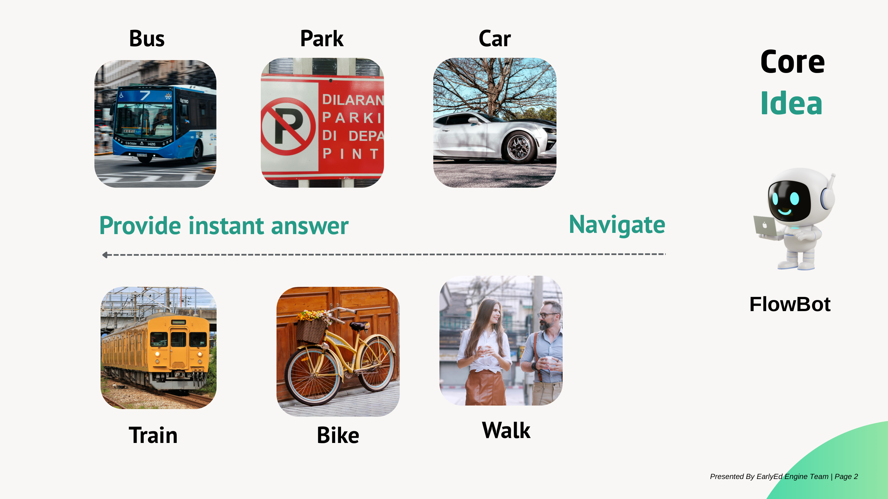

<p align="center">
  
</p>

<h1 align="center">FlowBot</h1>

<p align="center">
  <strong>Your easy guide to getting around Boston</strong><br>
  One conversation replaces five application.
</p>

<p align="center">
  
  
  
  
  
  
  
</p>

<p align="center">
  <a href="#what-is-flowbot">What is FlowBot?</a>&nbsp;&nbsp;&bull;&nbsp;&nbsp;
  <a href="#features">Features</a>&nbsp;&nbsp;&bull;&nbsp;&nbsp;
  <a href="#the-problem">The Problem</a>&nbsp;&nbsp;&bull;&nbsp;&nbsp;
  <a href="#our-solution">Our Solution</a>&nbsp;&nbsp;&bull;&nbsp;&nbsp;
  <a href="#demo">Demo</a>&nbsp;&nbsp;&bull;&nbsp;&nbsp;
  <a href="#architecture">Architecture</a>&nbsp;&nbsp;&bull;&nbsp;&nbsp;
  <a href="#data-sources">Data Sources</a>&nbsp;&nbsp;&bull;&nbsp;&nbsp;
  <a href="#prompt-design">Prompt Design</a>&nbsp;&nbsp;&bull;&nbsp;&nbsp;
  <a href="#limitations">Limitations</a>&nbsp;&nbsp;&bull;&nbsp;&nbsp;
  <a href="#future-work">Future Work</a>&nbsp;&nbsp;&bull;&nbsp;&nbsp;
  <a href="#evaluation-plan">Evaluation Plan</a>&nbsp;&nbsp;&bull;&nbsp;&nbsp;
  <a href="#team">Team</a>&nbsp;&nbsp;&bull;&nbsp;&nbsp;
  <a href="#references">References</a>
</p>

---

## What is FlowBot?

FlowBot, a RAG-based navigation chatbot, is an navigation chatbot that guides you to navigate Boston using **buses, trains, bikes, walking, and driving**, all in one place. Instead of switching between MBTA, Google Maps, Bluebikes, and parking apps, you could  FlowBot a single question and get a clear, sourced answer comparing your options.

> *"I want to commute to Boston now."*
>
> FlowBot, a RAG-based navigation chatbot, also make comparision between routes across every  transportation mode, including time, cost, and convenience so you can pick the optimal solution.

RAG, stands for Retrieval-Augmented Generation, a GenAI (Gen) Framework augments Large Language Models with our scraped data from multiple sources to help AI-powered software, such as chatbots, communicate more effectively with users.
---

## Features

<p align="center">
  
</p>

| | Feature | What It Does |
|---|---|---|
| :bus: | **Bus & Train** | Real-time MBTA schedules, route options, service alerts |
| :car: | **Driving** | Traffic-aware directions with time and cost estimates |
| :parking: | **Parking + Sign Reader** | Upload a photo of any parking sign and get a plain-English answer plus nearby alternatives |
| :bike: | **Biking** | Live Bluebikes station availability (bikes and open docks) |
| :walking: | **Walking** | Walkable route suggestions with distance and time |
| :bar_chart: | **Smart Comparison** | Side-by-side breakdown across all modes for the same trip |

---

## The Problem

<p align="center">
  
</p>

We had an informal discussion for the group of students, who are currently studying and living in Boston area. There are several key problems we identified:

1. Google map does not have information of shuttle bus.
2. There is a need to integrate BlueBike with the current application, and an application where users can scan, and get information immediately. For instance, users prefer an application where they can see both paid, and free option.
3. Parking Sign sometimes provide misleading information, which make people confused.
4. Users also desire to have an application to suggest best routes, and potential delays. Users sometimes get confused on number of busses, its schedule as well.

---

## Our Solution

<p align="center">
  
</p>

FlowBot addresses each problem with a specific capability:

**01. Route Planner**
Compare time and cost across bus, train, bike, walking, and driving for any trip. One question, all options.

**02. Parking + Sign Reader**
Upload a photo of a parking sign and get an instant, plain-English explanation, plus nearby alternatives if you can't park there.

**03. Multi-Modal Urban Intelligence**
A unified conversational interface that combines transit, buses, biking, walking, and driving into a single answer grounded in real data.

---

## Demo

<p align="center">
  
</p>

<p align="center"><em>FlowBot's chat interface with quick-action suggestion chips</em></p>

**Try asking:**

| Question | What FlowBot Does |
|---|---|
| *"Fastest way to Boston Common"* | Compares bus, train, bike, walking, and driving with times and costs |
| *"What does this sign mean?"* | Reads an uploaded parking sign photo and explains the rules |
| *"Can I park here?"* | Checks parking regulations for your area and suggests alternatives |
| *"Is the Green Line running?"* | Pulls real-time MBTA service alerts and schedule updates |
| *"Nearest Bluebikes station"* | Shows live bike and dock availability at nearby stations |

**[Download the full demo video](https://github.com/ramihuunguyen/FlowBot/raw/main/FlowBotDemo.mp4)**

---

## Architecture

FlowBot uses a **Retrieval-Augmented Generation (RAG)** pipeline. Every answer is grounded in real data, not hallucinated.

```
User Question
     |
     v
Query Expansion ──── 10 topic categories add relevant keywords
     |
     v
Hybrid Retrieval
  ├── Vector Search ── Semantic similarity (384-dim embeddings)
  └── BM25 Search ──── Exact keyword matching
     |
     v
Deduplication ──────── Merge results, remove duplicates
     |
     v
Cross-Encoder Reranking ── Re-score (query, passage) pairs
     |
     v
Context Builder ────── Format top passages + source URLs
     |
     v
LLM Generation ────── Structured answer with cited sources
     |
     v
Response ──────────── Main answer (max 100 words) + source links
```

**By the numbers:**

| Metric | Value |
|---|---|
| Documents scraped | 12,466 |
| Searchable passages | 12,943 |
| Embedding dimensions | 384 (MiniLM-L6-v2) |
| Reranker | BGE-Reranker-v2-M3 |
| Query expansion categories | 10 (transit, parking, biking, delays, signs, accessibility, traffic, walking, route planning, schedules) |

### Pipeline Code Snippets

**Query Expansion** — appends topic-specific keywords to the user's query before embedding:

```python
QUERY_HINTS = {
    ("how do i get to", "best way to", "directions to", "route to"): (
        "route bus train walking driving biking MBTA Bluebikes directions "
        "travel time cost transportation options"
    ),
    ("parking", "where can i park", "parking sign", "can i park here"): (
        "parking sign restriction street cleaning tow zone meter resident "
        "permit handicapped fire hydrant loading zone"
    ),
    # ... 8 more topic categories
}

def expand_query(self, query):
    query_lower = query.lower()
    hints = []
    for keywords, hint in QUERY_HINTS.items():
        if any(kw in query_lower for kw in keywords):
            hints.append(hint)
    if hints:
        return query + " " + " ".join(hints)
    return query
```

**Vector Search** — encodes the expanded query and finds the most similar passages by cosine similarity:

```python
def search(self, query, k=5):
    q = self.model.encode(self.expand_query(query))
    cos_scores = util.cos_sim(q, self.passage_embeddings)
    top_k = topk(cos_scores, k=k)
    results = []
    for index in top_k[1][0]:
        p_id = self.passage_ids[index]
        p_txt = self.passage_texts[index]
        score = cos_scores[0][index].item()
        results.append(dict(passage_id=p_id, passage_text=p_txt, score=score))
    return results
```

**BM25 Keyword Search** — lexical matching to catch exact terms that semantic search might miss:

```python
def search(self, query, k=10):
    tokenized_query = _tokenize(query)
    scores = self.bm25.get_scores(tokenized_query)
    top_indices = sorted(range(len(scores)), key=lambda i: scores[i], reverse=True)[:k]
    results = []
    for idx in top_indices:
        results.append(dict(
            passage_id=self.passage_ids[idx],
            passage_text=self.passage_texts[idx],
            score=float(scores[idx])
        ))
    return results
```

**Deduplication** — merges results from both searches, prioritizing vector results:

```python
def deduplicate_passages(keyword_results, vector_results):
    seen = set()
    unique_results = []
    for dic in vector_results:
        passage_id = dic['passage_id']
        if passage_id not in seen:
            unique_results.append(dic)
            seen.add(passage_id)
    for dic in keyword_results:
        passage_id = dic['passage_id']
        if passage_id not in seen:
            unique_results.append(dic)
            seen.add(passage_id)
    return unique_results
```

**Cross-Encoder Reranking** — re-scores each (query, passage) pair for more accurate ranking:

```python
def rerank_passages(self, query, results, k=10):
    Q_A = []
    for dic in results:
        Q_A.append((query, dic['passage_text']))
    scores = self.model.predict(Q_A)
    scores = torch.tensor(scores)
    top_k = topk(scores, k=min(k, len(scores)))
    reranked_passages = []
    for i in top_k.indices:
        index = int(i)
        reranked_passages.append(dict(
            passage_id=results[index]["passage_id"],
            passage_text=results[index]["passage_text"],
            rerank_score=float(scores[index])
        ))
    return reranked_passages
```

**Context Builder** — formats the top passages with metadata into a context string for the LLM:

```python
def build_context(passage_entries, db_name):
    db = Database(db_name)
    info = db.retrieve_info_for_passage_ids([e["passage_id"] for e in passage_entries])
    context = ""
    sources = []
    seen_titles = set()
    for entry in passage_entries:
        row = info.get(entry["passage_id"])
        title, source_type, url, author, pub_date, passage_text = row
        context += (
            "\n---\n"
            "Title: " + title + "\nSource: " + source_type + "\n"
            "URL: " + url + "\nText: " + passage_text + "\n"
        )
        if title not in seen_titles:
            seen_titles.add(title)
            sources.append({"title": title, "url": url})
    return context, sources
```

---

## Data Sources

FlowBot pulls from **11 public data sources**. No paid APIs required.

| Source | What It Provides | Records |
|---|---|---|
| MBTA Routes API | All 177 bus, subway, commuter rail, and ferry routes | 177 |
| MBTA Stops API | Every stop and station across the network | 10,268 |
| Bluebikes GBFS Feed | 596 bike-share stations with real-time availability | 596 |
| MBTA Accessibility Pages | Accessibility info for stations and services | Web scrape |
| Boston Transportation Dept | City transportation policies and updates | Web scrape |
| Boston Parking Info | Parking regulations, meters, and resident permits | Web scrape |
| Parking/Road Sign Explanations | Plain-English explanations for 15 common sign types | Curated |
| Mass511 Traffic Incidents | Real-time traffic incidents and road closures | API/Scrape |
| Overpass API (Walking Paths) | Pedestrian paths, sidewalks, and walking routes | API fetch |
| Boston Data Portal | Traffic signals, Vision Zero crash data | API fetch |
| MA Driver's Manual | 62 pages of sign rules and driving regulations | PDF extraction |

---

## Prompt Design

FlowBot's system prompt instructs the LLM to act as a smart transportation expert and enforces a strict reasoning and output format:

- **Step-by-step reasoning.** Before generating an answer, the LLM must work through four steps: identify what the user is asking, select the most relevant retrieved passages, extract key facts from keyword hints, and then compose the response.
- **Structured output.** Every response follows a fixed two-part format: a concise main answer (one paragraph, max 100 words) followed by a "Learn more from these sources" section with named, clickable links.
- **Tone adaptation.** The prompt adjusts language based on the user: friendly and simple for students, formal and professional for job seekers.
- **Scope enforcement.** The LLM only responds using knowledge from the retrieved context. Questions outside Boston transportation (personal life, entertainment, unrelated topics) receive a polite redirect rather than a hallucinated answer.

---

## Limitations

- **Boston only.** FlowBot is built for the Boston metro area. It does not cover other cities or regions.
- **Real-time data depends on external APIs.** MBTA, Bluebikes, and Mass511 data are only as current as their respective APIs allow. Outages or delays on those services affect FlowBot's answers.
- **Parking sign reader depends on image quality.** Blurry, cropped, or poorly lit photos may produce inaccurate interpretations.
- **LLM generation is not guaranteed to be perfect.** Despite RAG grounding and source citation, the LLM may occasionally misinterpret retrieved passages or omit relevant details.
- **No user accounts or saved trips.** Each conversation starts fresh with no history or personalization.

---

## Future Work

- **Live location support.** Allow users to share their location for automatic "from here" routing instead of typing an origin.
- **Conversation memory.** Save past trips and preferences so FlowBot can learn commute patterns and suggest faster options over time.
- **Multi-city expansion.** Generalize the data pipeline to support other cities with public transit APIs (e.g., New York MTA, Chicago CTA).
- **Real-time alerts and notifications.** Proactively notify users of service disruptions, delays, or parking restrictions on their saved routes.
- **Evaluation framework.** Implement a structured evaluation plan to measure retrieval accuracy, answer quality, and user satisfaction (see [Evaluation Plan](#evaluation-plan)).

---

## Evaluation Plan

FlowBot's evaluation plan follows a dual-judge framework that measures both retrieval quality and generation quality using lexical metrics and independent LLM judges.

**Retrieval Metrics:**

| Metric | What It Measures |
|---|---|
| Recall@K | How many relevant sources are found out of the total relevant |
| Precision@K | How many retrieved chunks are actually relevant |
| Context Recall | Whether ground truth sources appear in retrieved titles |
| Context Precision | How many retrieved chunks support the correct answer |

**Generation Metrics:**

| Metric | What It Measures |
|---|---|
| BERTScore | Semantic similarity between generated and ground truth answers |
| Faithfulness | Whether all claims in the answer are grounded in retrieved context |
| Answer Relevance | Whether the answer directly addresses the user's question |
| Conciseness | Whether the answer length is appropriate (1-5 scale) |

**How it works:**

1. **Test dataset.** Curate questions across difficulty levels (basic, medium, complex) covering all six transportation modes plus safety and adversarial prompts.
2. **Lexical scoring.** Run token-overlap and string-matching metrics with zero API cost for fast iteration.
3. **Dual LLM judges.** Two independent models score each answer to prevent single-model bias.
4. **Progressive experiments.** Test pipeline variants (vector-only, hybrid retrieval, reranking) to measure improvement at each stage.

This evaluation plan is not yet implemented for FlowBot and is planned as future work.

---

## Team

Built at **UMass Boston** — CS 438/638, Spring 2026, with the guidance of Computer Science Professor **Wei Ding**.

| | |
|---|---|
| **[Rami Huu Nguyen](https://www.linkedin.com/in/ramihuunguyen)** | **[Justin J McMahon](https://www.linkedin.com/in/justin-mcmahon-b17b9140a)** |
| **[Domenic B DiClemente](https://www.linkedin.com/in/domenic-diclemente-76a047262)** | **[Igor Ten](https://www.linkedin.com/in/igor-ten-103748344)** |
| **[Ajanee T Igharo](https://www.linkedin.com/in/ajaneeigharo)** | **[MeghSanjaykumar Patel](https://in.linkedin.com/in/megh-patel-006900214)** |
| **Felipe Mahecha** | **[Syed Taswar Mahbub](https://www.linkedin.com/in/syed-taswar-mahbub-272267183)** |

---

## References

**Core Architecture:**

- Lewis, P. et al. (2020). *Retrieval-Augmented Generation for Knowledge-Intensive NLP Tasks.* NeurIPS 2020. [arXiv:2005.11401](https://arxiv.org/abs/2005.11401)

**Embedding Model (all-MiniLM-L6-v2):**

- Reimers, N. & Gurevych, I. (2019). *Sentence-BERT: Sentence Embeddings using Siamese BERT-Networks.* EMNLP 2019. [arXiv:1908.10084](https://arxiv.org/abs/1908.10084)
- Wang, W. et al. (2020). *MiniLM: Deep Self-Attention Distillation for Task-Agnostic Compression of Pre-Trained Transformers.* NeurIPS 2020. [arXiv:2002.10957](https://arxiv.org/abs/2002.10957)

**Reranker (BGE-Reranker-v2-M3):**

- Xiao, S. et al. (2024). *C-Pack: Packed Resources For General Chinese Embeddings.* SIGIR 2024. [arXiv:2309.07597](https://arxiv.org/abs/2309.07597)
  
- Chen, J. et al. (2024). *BGE M3-Embedding: Multi-Linguality, Multi-Functionality, Multi-Granularity Text Embeddings Through Self-Knowledge Distillation.* [arXiv:2402.03216](https://arxiv.org/abs/2402.03216)

- https://www.k2view.com/blog/rag-chatbot/ 

**Keyword Search:**

- Robertson, S. & Zaragoza, H. (2009). *The Probabilistic Relevance Framework: BM25 and Beyond.* Foundations and Trends in Information Retrieval, 3(4), 333-389. [DOI:10.1561/1500000019](https://doi.org/10.1561/1500000019)

**Libraries and Tools:**

| Tool | Documentation |
|---|---|
| sentence-transformers | [sbert.net](https://www.sbert.net/) |
| rank-bm25 | [github.com/dorianbrown/rank_bm25](https://github.com/dorianbrown/rank_bm25) |
| Flask | [flask.palletsprojects.com](https://flask.palletsprojects.com/) |
| React | [react.dev](https://react.dev/) |
| Tailwind CSS | [tailwindcss.com](https://tailwindcss.com/) |
| Vite | [vite.dev](https://vite.dev/) |
| SQLite | [sqlite.org](https://www.sqlite.org/) |
| BeautifulSoup4 | [crummy.com/software/BeautifulSoup](https://www.crummy.com/software/BeautifulSoup/) |
| pdfplumber | [github.com/jsvine/pdfplumber](https://github.com/jsvine/pdfplumber) |
| OpenRouter | [openrouter.ai](https://openrouter.ai/docs/quickstart) |

---

<p align="center">
  
</p>

<p align="center">
  <strong>Curious about the details?</strong><br>
  Open an issue or reach out to any team member.
</p>

