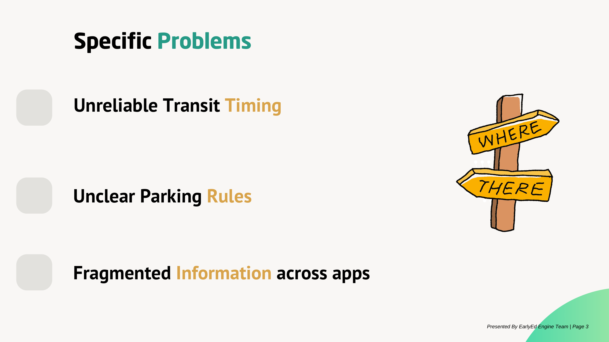
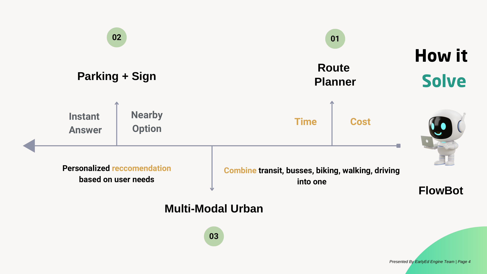
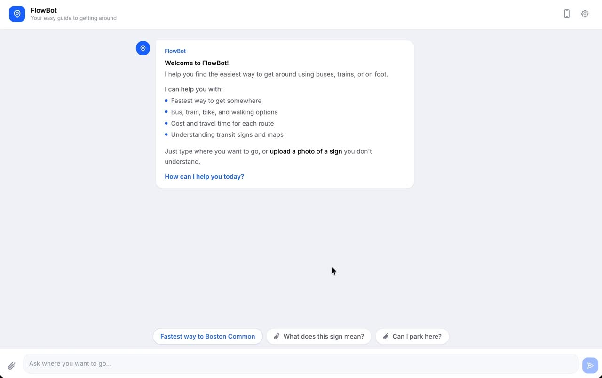
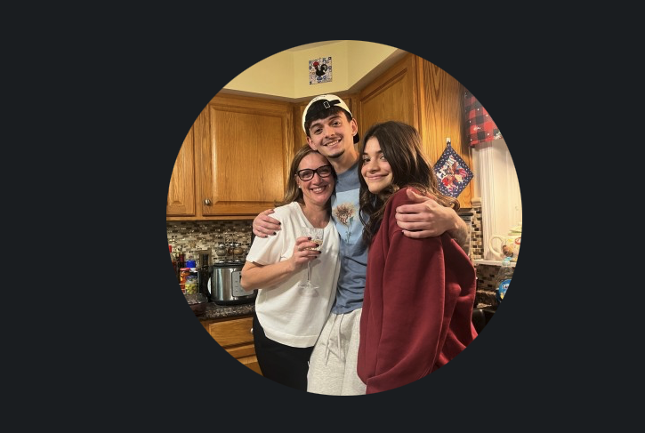
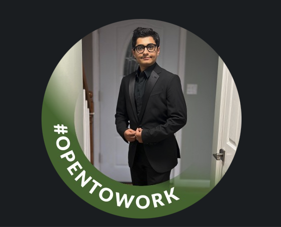
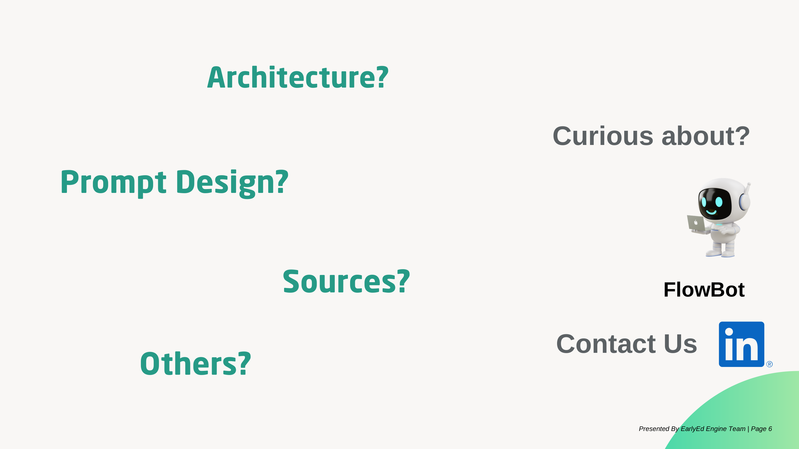

<p align="center">
  
</p>

<h1 align="center">FlowBot</h1>

<p align="center">
  <strong>Your RAG-based navigation chatbot getting around Boston</strong><br>
</p>

<p align="center">
  
  
  
  
  
  
  
</p>

<p align="center">
  <a href="#what-is-flowbot">What is FlowBot?</a>&nbsp;&nbsp;&bull;&nbsp;&nbsp;
  <a href="#features">Features</a>&nbsp;&nbsp;&bull;&nbsp;&nbsp;
  <a href="#the-problem">The Problem</a>&nbsp;&nbsp;&bull;&nbsp;&nbsp;
  <a href="#our-solution">Our Solution</a>&nbsp;&nbsp;&bull;&nbsp;&nbsp;
  <a href="#demo">Demo</a>&nbsp;&nbsp;&bull;&nbsp;&nbsp;
  <a href="#architecture">Architecture</a>&nbsp;&nbsp;&bull;&nbsp;&nbsp;
  <a href="#data-sources">Data Sources</a>&nbsp;&nbsp;&bull;&nbsp;&nbsp;
  <a href="#prompt-design">Prompt Design</a>&nbsp;&nbsp;&bull;&nbsp;&nbsp;
  <a href="#limitations">Limitations</a>&nbsp;&nbsp;&bull;&nbsp;&nbsp;
  <a href="#future-work">Future Work</a>&nbsp;&nbsp;&bull;&nbsp;&nbsp;
  <a href="#evaluation-plan">Evaluation Plan</a>&nbsp;&nbsp;&bull;&nbsp;&nbsp;
  <a href="#references">References</a>&nbsp;&nbsp;&bull;&nbsp;&nbsp;
  <a href="#team">Team</a>
</p>

## What is FlowBot?

FlowBot, a RAG-based navigation chatbot, is an navigation chatbot that guides you to navigate Boston using **buses, trains, bikes, walking, and driving**, all in one place. Instead of switching between MBTA, Google Maps, Bluebikes, and parking apps, you could  FlowBot a single question and get a clear, sourced answer comparing your options.

> *"I want to commute to Boston now."*
>
> FlowBot, a RAG-based navigation chatbot, also make comparision between routes across every  transportation mode, including time, cost, and convenience so you can pick the optimal solution.

> RAG, stands for Retrieval-Augmented Generation, a GenAI (Gen) Framework augments Large Language Models with our scraped data from multiple sources to help AI-powered software, such as chatbots, communicate more effectively with users.

## The Problem

<p align="center">
  
</p>

We had an informal discussion for the group of students, who are currently studying and living in Boston area. There are several key problems we identified:

1. Google map does not have information of shuttle bus.
2. There is a need to integrate BlueBike with the current application, and an application where users can scan, and get information immediately. For instance, users prefer an application where they can see both paid, and free option.
3. Parking Sign sometimes provide misleading information, which make people confused.
4. Users also desire to have an application to suggest best routes, and potential delays. Users sometimes get confused on number of busses, its schedule as well.

## Our Solution

<p align="center">
  
</p>

FlowBot solve all user's problem with two specific functions:

- The first function is named as Route Planner, where the chatbot enables users to interact with chatbot to perform the comparision between each transporation model instantly. 

- The second function is called Parking and Sign Reader. Users can upload a photo of parking sign into FlowBot, and they can receive an instant information from the website.

---

## Demo

<p align="center">
  
</p>

<p align="center"><em>FlowBot's chat interface with quick-action suggestion chips</em></p>

**Try asking:**

| Question | What FlowBot Does |
|---|---|
| *"Fastest way to Boston Common"* | Compares bus, train, bike, walking, and driving with times and costs |
| *"What does this sign mean?"* | Reads an uploaded parking sign photo and explains the rules |
| *"Can I park here?"* | Checks parking regulations for your area and suggests alternatives |
| *"Is the Green Line running?"* | Pulls real-time MBTA service alerts and schedule updates |
| *"Nearest Bluebikes station"* | Shows live bike and dock availability at nearby stations |

**[Download the full demo video](https://github.com/ramihuunguyen/FlowBot/raw/main/FlowBotDemo.mp4)**

---

## Architecture

FlowBot uses a **Retrieval-Augmented Generation (RAG)** pipeline. The main goal is that every answer is grounded in real data instead of just being generated randomly or hallucinated. Rather than being a model focused on only one specific area, FlowBot retrieves relevant transportation information, including static data and real-time API data, organizes that information in our database, and then uses it as context to generate a grounded response or route for the user. Sources are also included so users can see where the information came from and to help prevent hallucinations.


```
User Question
     |
     v
Query Expansion ──── 10 topic categories add relevant keywords
     |
     v
Hybrid Retrieval
  ├── Vector Search ── Semantic similarity (384-dim embeddings)
  └── BM25 Search ──── Exact keyword matching
     |
     v
Deduplication ──────── Merge results, remove duplicates
     |
     v
Cross-Encoder Reranking ── Re-score (query, passage) pairs
     |
     v
Context Builder ────── Format top passages + source URLs
     |
     v
LLM Generation ────── Structured answer with cited sources
     |
     v
Response ──────────── Main answer (max 100 words) + source links
```
### FlowBot System & Data Overview

A quick look at the data, retrieval setup, and search components inside FlowBot:

| Metric | Value |
|---|---|
| Documents scraped | 12,466 |
| Searchable passages | 12,943 |
| Embedding dimensions | 384 (MiniLM-L6-v2) |
| Reranker | BGE-Reranker-v2-M3 |
| Query expansion categories | 10 (transit, parking, biking, delays, signs, accessibility, traffic, walking, route planning, schedules) |

### Pipeline Code Snippets

**Query Expansion** — FlowBot uses query expansion to make user searches more specific before they are embedded. When a user asks something like “how do I get to,” “best way to,” or “where can I park,” FlowBot checks the query for certain keywords and adds topic-specific transportation terms behind the scenes.

```python
QUERY_HINTS = {
    ("how do i get to", "best way to", "directions to", "route to"): (
        "route bus train walking driving biking MBTA Bluebikes directions "
        "travel time cost transportation options"
    ),
    ("parking", "where can i park", "parking sign", "can i park here"): (
        "parking sign restriction street cleaning tow zone meter resident "
        "permit handicapped fire hydrant loading zone"
    ),
    # ... 8 more topic categories
}

def expand_query(self, query):
    query_lower = query.lower()
    hints = []
    for keywords, hint in QUERY_HINTS.items():
        if any(kw in query_lower for kw in keywords):
            hints.append(hint)
    if hints:
        return query + " " + " ".join(hints)
    return query
```

**Vector Search** — FlowBot uses vector search to find the passages that are most similar to the user’s question. After the query is expanded, FlowBot turns it into an embedding, a numerical representation of the query. It then compares that query embedding against the stored passage embeddings using cosine similarity. The passages with the highest similarity scores are returned as the most relevant results.

```python
def search(self, query, k=5):
    q = self.model.encode(self.expand_query(query))
    cos_scores = util.cos_sim(q, self.passage_embeddings)
    top_k = topk(cos_scores, k=k)
    results = []
    for index in top_k[1][0]:
        p_id = self.passage_ids[index]
        p_txt = self.passage_texts[index]
        score = cos_scores[0][index].item()
        results.append(dict(passage_id=p_id, passage_text=p_txt, score=score))
    return results
```

**BM25 Keyword Search** — FlowBot uses BM25 keyword search to catch exact words or phrases that vector search might miss. While vector search is good for finding passages with similar meaning, BM25 focuses more on lexical matching, meaning it looks for the actual terms in the user’s query. This is useful in conjunction with vector search because it helps FlowBot retrieve results based on both meaning and exact wording.

```python
def search(self, query, k=10):
    tokenized_query = _tokenize(query)
    scores = self.bm25.get_scores(tokenized_query)
    top_indices = sorted(range(len(scores)), key=lambda i: scores[i], reverse=True)[:k]
    results = []
    for idx in top_indices:
        results.append(dict(
            passage_id=self.passage_ids[idx],
            passage_text=self.passage_texts[idx],
            score=float(scores[idx])
        ))
    return results
```

**Deduplication** — FlowBot merges vector search and BM25 results while removing duplicate passages. Vector results are prioritized first, then any unique BM25 results are added after.

```python
def deduplicate_passages(keyword_results, vector_results):
    seen = set()
    unique_results = []
    for dic in vector_results:
        passage_id = dic['passage_id']
        if passage_id not in seen:
            unique_results.append(dic)
            seen.add(passage_id)
    for dic in keyword_results:
        passage_id = dic['passage_id']
        if passage_id not in seen:
            unique_results.append(dic)
            seen.add(passage_id)
    return unique_results
```

**Cross-Encoder Reranking** — FlowBot uses **BGE-Reranker-v2-M3** to re-rank the retrieved passages after vector search and BM25 search. Vector search quickly finds passages that are generally similar to the query, but the reranker looks more closely at each full query-and-passage pair. This helps FlowBot sort the results more accurately and utilize only the most useful transportation information correlating to the users query.

```python
def rerank_passages(self, query, results, k=10):
    Q_A = []
    for dic in results:
        Q_A.append((query, dic['passage_text']))
    scores = self.model.predict(Q_A)
    scores = torch.tensor(scores)
    top_k = topk(scores, k=min(k, len(scores)))
    reranked_passages = []
    for i in top_k.indices:
        index = int(i)
        reranked_passages.append(dict(
            passage_id=results[index]["passage_id"],
            passage_text=results[index]["passage_text"],
            rerank_score=float(scores[index])
        ))
    return reranked_passages
```

**Context Builder** — FlowBot uses a context builder to turn the top retrieved passages into a structured context section for the model message. After the previous steps, FlowBot pulls their metadata from the database like title, source type, URL, and passage text. This lets the LLM generate an answer using organized source material and utilizing the ordering produced in the reranker step.

```python
def build_context(passage_entries, db_name):
    db = Database(db_name)
    info = db.retrieve_info_for_passage_ids([e["passage_id"] for e in passage_entries])
    context = ""
    sources = []
    seen_titles = set()
    for entry in passage_entries:
        row = info.get(entry["passage_id"])
        title, source_type, url, author, pub_date, passage_text = row
        context += (
            "\n---\n"
            "Title: " + title + "\nSource: " + source_type + "\n"
            "URL: " + url + "\nText: " + passage_text + "\n"
        )
        if title not in seen_titles:
            seen_titles.add(title)
            sources.append({"title": title, "url": url})
    return context, sources
```

---
## Data Sources

We collected data from 11 different public sources, scraping the data from the public websites. FlowBot did not use any paid APIs and all our sources are categorized below:

**Transit:** We extracted route and stop data using the MBTA Routes and Stops APIs which gave us 177 routes (buses, subways, commuter rails, and ferry routes) and 10,268 stops and stations. Furthermore, we extracted station accessibility information from their accessibility pages.

**Biking:** We used the Bluebikes GBFS feed to get real-time data about availability from 596 bike sharing stations.

**Parking and Signs:** We found relevant information about parking regulations, parking meters and resident permits from the city of Boston, we then wrote easy to understand English explanations for 15 common sign types and then extracted 62 pages of sign rules from the Massachusetts Driver's manual using PDF extraction.

**Driving and Traffic:** We get real-time incidents and road closures data from Mass511 Traffic incidents and traffic signal and traffic crash data from the Boston Data portal.

**Walking:** We used the Overpass API to get pedestrian paths, sidewalks and walking routes.

**City Policy:** We retrieved general transportation policies and updates from the Boston Transportation Department.

---

## Prompt Design

FlowBot's system prompt instructs the LLM to act as a smart transportation expert and enforces a strict reasoning and output format:

- **Step-by-step reasoning.** Before generating an answer, the LLM must work through four steps: identify what the user is asking, select the most relevant retrieved passages, extract key facts from keyword hints, and then compose the response.
- **Structured output.** Every response follows a fixed two-part format: a concise main answer (one paragraph, max 100 words) followed by a "Learn more from these sources" section with named, clickable links.
- **Tone adaptation.** The prompt adjusts language based on the user: friendly and simple for students, formal and professional for job seekers.
- **Scope enforcement.** The LLM only responds using knowledge from the retrieved context. Questions outside Boston transportation (personal life, entertainment, unrelated topics) receive a polite redirect rather than a hallucinated answer.

---

## Limitations

- FlowBot only works for the Boston metro area and does not cover other cities.
- We have used external APIs including MBTA, Bluebikes, and Mass511 to get real-time data. The problem this might cause is that if these services are down or experiencing delays, FlowBot will also be affected since it depends on these services.
- The parking sign reader requires a clear photo to work effectively, meaning blurry or cut-off images would cause the sign reader to not work correctly.
- Although we use RAG system to limit the answers to real data and cite sources appropriately, large language models are not perfect themselves, and can still make mistakes or occasionally miss details.
- We do not have any user accounts and hence every conversation starts from new and has no saved history - the experience cannot be personalized as a result.

---

## Future Work

- Add a feature to allow users to share their current location so that FlowBot can use it as the starting point, rather than having to manually type in where they currently are.
- Add a memory feature so FlowBot can remember past trips and user preferences from conversations, leading to FlowBot learning from memory and commute patterns and suggesting better options over time.
- Expand FlowBot's functionality to multiple cities that also offer public transit APIs such as New York city or Chicago.
- Add a feature to provide real time alerts and notifications, notifying users about disruptions in service, delays or parking restrictions on regularly commuted roads.
- Build out a structured evaluation framework to effectively measure how well the retrieval and answer generations are actually performing and also add a feature to track user satisfaction. For further information on this, check out the [Evaluation Plan](#evaluation-plan) section.

---

## Evaluation Plan

FlowBot's evaluation plan follows a dual-judge framework that measures both retrieval quality and generation quality using lexical metrics and independent LLM judges.

**Retrieval Metrics:**

| Metric | What It Measures |
|---|---|
| Recall@K | How many relevant sources are found out of the total relevant |
| Precision@K | How many retrieved chunks are actually relevant |
| Context Recall | Whether ground truth sources appear in retrieved titles |
| Context Precision | How many retrieved chunks support the correct answer |

**Generation Metrics:**

| Metric | What It Measures |
|---|---|
| BERTScore | Semantic similarity between generated and ground truth answers |
| Faithfulness | Whether all claims in the answer are grounded in retrieved context |
| Answer Relevance | Whether the answer directly addresses the user's question |
| Conciseness | Whether the answer length is appropriate (1-5 scale) |

**How it works:**

1. **Test dataset.** Curate questions across difficulty levels (basic, medium, complex) covering all six transportation modes plus safety and adversarial prompts.
2. **Lexical scoring.** Run token-overlap and string-matching metrics with zero API cost for fast iteration.
3. **Dual LLM judges.** Two independent models score each answer to prevent single-model bias.
4. **Progressive experiments.** Test pipeline variants (vector-only, hybrid retrieval, reranking) to measure improvement at each stage.

This evaluation plan is not yet implemented for FlowBot and is planned as future work.

---

## References

**Core Architecture:**

- Lewis, P. et al. (2020). *Retrieval-Augmented Generation for Knowledge-Intensive NLP Tasks.* NeurIPS 2020. [arXiv:2005.11401](https://arxiv.org/abs/2005.11401)

**Embedding Model (all-MiniLM-L6-v2):**

- Reimers, N. & Gurevych, I. (2019). *Sentence-BERT: Sentence Embeddings using Siamese BERT-Networks.* EMNLP 2019. [arXiv:1908.10084](https://arxiv.org/abs/1908.10084)
- Wang, W. et al. (2020). *MiniLM: Deep Self-Attention Distillation for Task-Agnostic Compression of Pre-Trained Transformers.* NeurIPS 2020. [arXiv:2002.10957](https://arxiv.org/abs/2002.10957)

**Reranker (BGE-Reranker-v2-M3):**

- Xiao, S. et al. (2024). *C-Pack: Packed Resources For General Chinese Embeddings.* SIGIR 2024. [arXiv:2309.07597](https://arxiv.org/abs/2309.07597)
  
- Chen, J. et al. (2024). *BGE M3-Embedding: Multi-Linguality, Multi-Functionality, Multi-Granularity Text Embeddings Through Self-Knowledge Distillation.* [arXiv:2402.03216](https://arxiv.org/abs/2402.03216)

- https://www.k2view.com/blog/rag-chatbot/ 

**Keyword Search:**

- Robertson, S. & Zaragoza, H. (2009). *The Probabilistic Relevance Framework: BM25 and Beyond.* Foundations and Trends in Information Retrieval, 3(4), 333-389. [DOI:10.1561/1500000019](https://doi.org/10.1561/1500000019)

**Libraries and Tools:**

| Tool | Documentation |
|---|---|
| sentence-transformers | [sbert.net](https://www.sbert.net/) |
| rank-bm25 | [github.com/dorianbrown/rank_bm25](https://github.com/dorianbrown/rank_bm25) |
| Flask | [flask.palletsprojects.com](https://flask.palletsprojects.com/) |
| React | [react.dev](https://react.dev/) |
| Tailwind CSS | [tailwindcss.com](https://tailwindcss.com/) |
| Vite | [vite.dev](https://vite.dev/) |
| SQLite | [sqlite.org](https://www.sqlite.org/) |
| BeautifulSoup4 | [crummy.com/software/BeautifulSoup](https://www.crummy.com/software/BeautifulSoup/) |
| pdfplumber | [github.com/jsvine/pdfplumber](https://github.com/jsvine/pdfplumber) |
| OpenRouter | [openrouter.ai](https://openrouter.ai/docs/quickstart) |

---

## Team

Built at **UMass Boston** — CS 438/638, Spring 2026, with the guidance of Computer Science Professor **Wei Ding**.

<table>
<tr>
<td align="center" width="250">
<br>
<strong><a href="https://www.linkedin.com/in/ramihuunguyen">Rami Huu Nguyen</a></strong><br>
<em>TODO: Add description</em>
</td>
<td align="center" width="250">
<br>
<strong><a href="https://www.linkedin.com/in/justin-mcmahon-b17b9140a">Justin J McMahon</a></strong><br>
<em>TODO: Add description</em>
</td>
<td align="center" width="250">
<br>
<strong><a href="https://www.linkedin.com/in/domenic-diclemente-76a047262">Domenic B DiClemente</a></strong><br>
<em>TODO: Add description</em>
</td>
<td align="center" width="250">
<br>
<strong><a href="https://www.linkedin.com/in/igor-ten-103748344">Igor Ten</a></strong><br>
<em>TODO: Add description</em>
</td>
</tr>
<tr>
<td align="center" width="250">
<br>
<strong><a href="https://www.linkedin.com/in/ajaneeigharo">Ajanee T Igharo</a></strong><br>
<em>TODO: Add description</em>
</td>
<td align="center" width="250">
<br>
<strong><a href="https://in.linkedin.com/in/megh-patel-006900214">MeghSanjaykumar Patel</a></strong><br>
<em>TODO: Add description</em>
</td>
<td align="center" width="250">
<br>
<strong><a href="https://www.linkedin.com/in/felipe-m-b31484217">Felipe Mahecha</a></strong><br>
<em>TODO: Add description</em>
</td>
<td align="center" width="250">
<br>
<strong><a href="https://www.linkedin.com/in/syed-taswar-mahbub-272267183">Syed Taswar Mahbub</a></strong><br>
<em>TODO: Add description</em>
</td>
</tr>
</table>

---

<p align="center">
  
</p>

<p align="center">
  <strong>Curious about the details?</strong><br>
  Open an issue or reach out to any team member.
</p>

